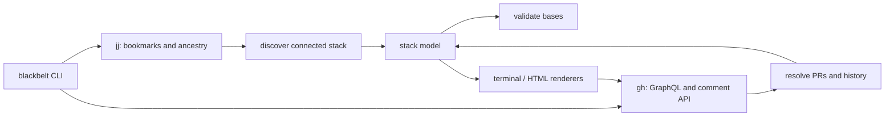

# Architecture

blackbelt is a thin CLI around two existing command-line contracts: `jj` supplies local topology and `gh` supplies GitHub PR data and comment mutation. Keeping those boundaries explicit avoids coupling the project to jj internals and keeps it portable wherever those CLIs work.

## Packages

- `cmd/blackbelt`: argument parsing and process exit behavior.
- `internal/blackbelt`: domain model, command runner, discovery, GitHub query construction, history persistence, validation, renderers, and comment updates.

The internal package has no dependencies beyond the Go standard library. `Runner` is an interface so unit tests can exercise discovery and rendering without jj, GitHub, or network access.

## Data flow

1. Read repository/default-branch metadata and discover tracked remote bookmarks connected to `@`.
2. Query matching PRs in one targeted GitHub GraphQL request, including comments and commit subjects.
3. Recover only merged historical nodes from a previous marked comment; cache that topology under `.jj/`.
4. Assign jj parentage, validate live GitHub bases, and render the single canonical stack model.
5. Preview it once in the terminal or update the marked comment on each PR.

## Invariants

- A PR bookmark maps to one commit and a commit maps to one PR bookmark.
- Multiple PR parents (merge-shaped DAG nodes) are rejected rather than guessed.
- Only GitHub-confirmed merged historical PRs are retained after bookmark cleanup.
- The invisible marker and encoded parent data make comment updates idempotent and preserve merged history.

When features grow, add them behind this model rather than letting presentation or shell invocation determine topology.
