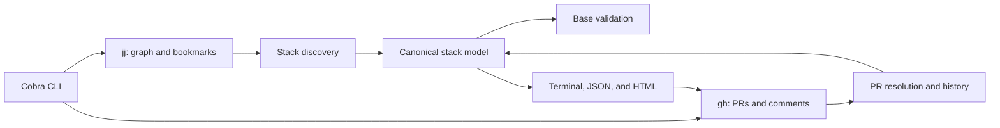

# Architecture

blackbelt is a thin CLI over stable command-line contracts: jj supplies local topology and `gh` supplies GitHub PR data and comment mutation. It does not link against jj internals or maintain its own stack database.

## Package boundaries

- `cmd/bb` contains the process entry point.
- `internal/cli` owns Cobra command registration.
- `internal/config` owns layered TOML configuration.
- `internal/doctor`, `internal/jjalias`, and `internal/completion` isolate setup concerns.
- `internal/blackbelt` owns discovery, topology, validation, rendering, history, and narrowly scoped GitHub updates.

External commands are behind a runner interface, keeping core behavior unit-testable without a repository or network. Presentation consumes the canonical model rather than rediscovering topology.

## Invariants

- A remotely tracked PR bookmark identifies one PR node.
- A PR may contain multiple jj commits.
- Merge-shaped nodes with multiple PR parents are rejected rather than guessed.
- Only GitHub-confirmed merged historical PRs survive bookmark cleanup.
- Diagram markers and encoded topology make GitHub updates idempotent.

See the repository's [`ARCHITECTURE.md`](https://github.com/EviHex/jj-blackbelt/blob/main/ARCHITECTURE.md) for the maintenance-oriented version of this document.
